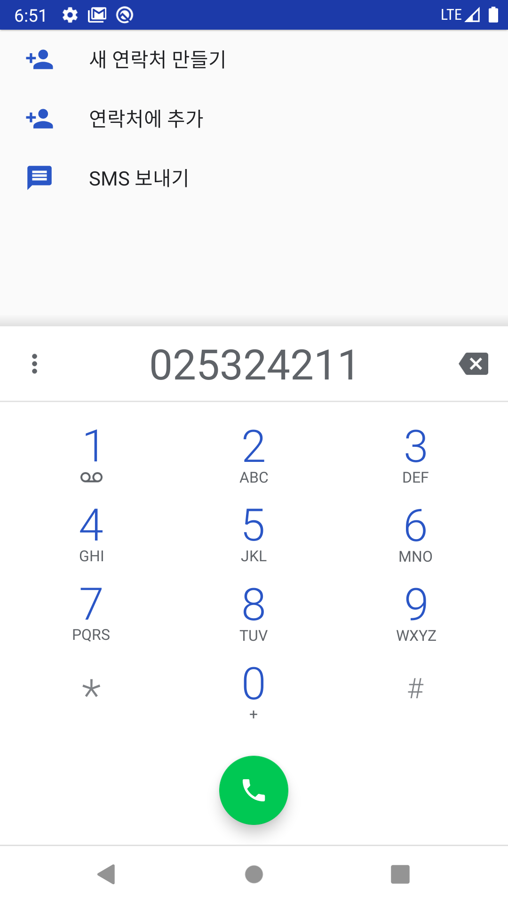
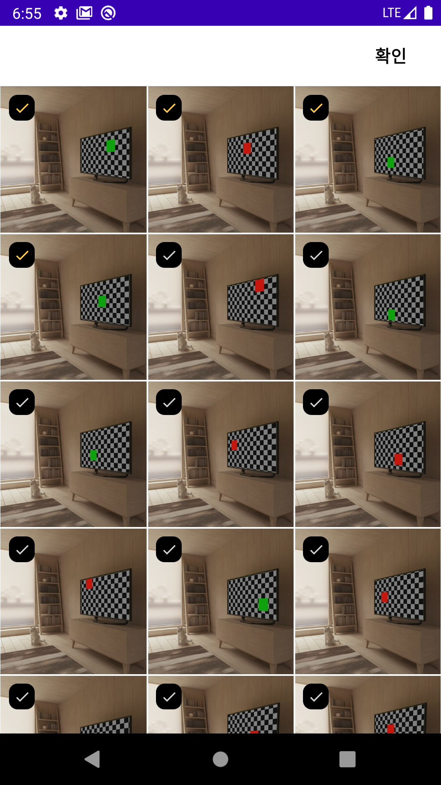

# Proj30_FoodDelivery
Android Clone Coding Project #30 FoodDelivery

## 결과 화면

| 1. 메인화면 > 홈탭(식당 리스트)                              | 2. 위치 변경 화면                                   | 3. 정렬 기능 > 별점 높은 순                                  |
| ------------------------------------------------------------ | --------------------------------------------------- | ------------------------------------------------------------ |
| | ||

| 4. 식당 상세화면                                    | 5. 찜 버튼 클릭                                   | 6. 스크롤 시 툴바 제목 애니메이션                            |
| --------------------------------------------------- | ------------------------------------------------- | ------------------------------------------------------------ |
|| | |

| 7. 식당 상세화면 > 전화                                    | 8. 찜 탭                                   | 9. 식당 상세화면 > 공유                                   |
| ---------------------------------------------------------- | ------------------------------------------ | --------------------------------------------------------- |
| | | |

| 10. 식당 상세화면 > 메뉴리스트                               | 11. 식당 상세화면 > 장바구니 추가                            | 12. 장바구니 추가 > 홈화면에 반영 된 장바구니 버튼           |
| ------------------------------------------------------------ | ------------------------------------------------------------ | ------------------------------------------------------------ |
|  |  | |

| 13. 다른 식당 상세화면 > 장바구니 담을 때 기존 비우기        | 14. 장바구니 버튼 클릭 > 주문 확인 리스트                    | 15. 주문 취소 > 장바구니 비우고 화면 종료                    |
| ------------------------------------------------------------ | ------------------------------------------------------------ | ------------------------------------------------------------ |
|  |  |  |

| 16. 장바구니 담기 > 로그인 되어 있지 않으면 프로필 탭 이동   | 17. My탭 - 로그인 필요                                   | 18. My탭 - 프로필 정보 불러오기                          |
| ------------------------------------------------------------ | -------------------------------------------------------- | -------------------------------------------------------- |
| |  | |

| 19. 리뷰 글 쓰기 화면                                   | 20. 사진 첨부 선택                                   | 21. 사진 첨부 선택 > 갤러리                                  |
| ------------------------------------------------------- | ---------------------------------------------------- | ------------------------------------------------------------ |
|| | |

| 22. 사진 첨부 > 카메라 사진 촬영                             | 23. 카메라 > 사진 미리보기                                   | 24. 리뷰 글 쓰기 화면 - 사진 첨부 후                         |
| ------------------------------------------------------------ | ------------------------------------------------------------ | ------------------------------------------------------------ |
| |  |  |

| 25. 리뷰 글 쓰기 화면 - 글 업로드 중                         | 26. 식당 상세 > 리뷰 리스트 화면                             |
| ------------------------------------------------------------ | ------------------------------------------------------------ |
| | |
